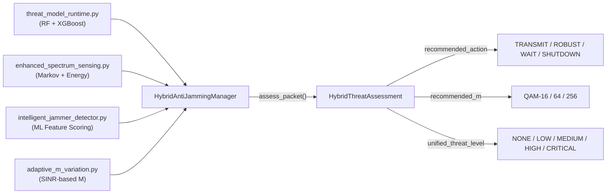
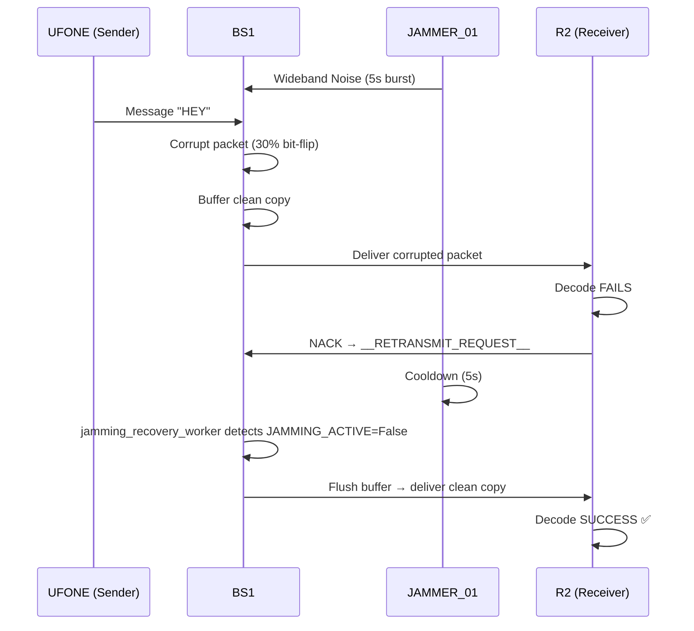

# Hybrid Anti-Jamming Pipeline — Implementation & Simulation Walkthrough

## 1. Overview

This document covers the implementation of **5 active anti-jamming countermeasures** into the existing Cognitive Radio Network simulation, and the end-to-end verification run performed with BS1, UFONE (sender), R2 (receiver), and Dynamic_Jammer (JAMMER_01).

### Simulation Topology

```
┌──────────┐      ┌────────────┐      ┌──────────┐
│  UFONE   │─────▶│    BS1     │─────▶│    R2    │
│ (Sender) │ :50050│(Base Stn)  │      │(Receiver)│
│ Primary  │◀─────│ Port 50050 │◀─────│          │
└──────────┘      └─────┬──────┘      └──────────┘
                        │
                  ┌─────┴──────┐
                  │ JAMMER_01  │
                  │ (Attacker) │
                  │ 5s ON/OFF  │
                  └────────────┘
```

| Node | File | Role |
|------|------|------|
| BS1 | `b1_hybrid.py` | Base Station relay, applies byte-level corruption during jamming |
| UFONE | `s_hybrid.py` | Primary User sender |
| R2 | `r_hybrid.py` | Receiver |
| JAMMER_01 | `Dynamic_Jammer.py` | Wideband barrage jammer, 5s burst / 5s cooldown cycles |

---

## 2. What Was Implemented

### Module Integration

All countermeasures are powered by the **HybridAntiJammingManager** ([hybrid_anti_jamming_manager.py](file:///d:/FAST/Semester%208/FYP/FYP-5G-Pipeline/hybrid_anti_jamming_manager.py)), which fuses four detection engines:



### 5 Countermeasure Strategies

#### Strategy 1 — Listen Before Talk (Sender Deferral)

**File:** [s_hybrid.py](file:///d:/FAST/Semester%208/FYP/FYP-5G-Pipeline/s_hybrid.py)

Before transmitting each message, the sender probes the channel via `_assess_channel()` and checks the `recommended_action`. If the action is `WAIT`, the sender **defers transmission** for 1.5 seconds and retries up to 3 times.

```python
for attempt in range(1, max_attempts + 1):
    assessment, action, M = _assess_channel(msg_bytes, nc, cp)
    if action == "WAIT":
        if attempt < max_attempts:
            print(f"[ANTI-JAM] Channel JAMMED. Deferring (attempt {attempt}/3)...")
            time.sleep(1.5)
            continue
        else:
            M = 16  # Force robust after 3 failed attempts
            break
```

> [!NOTE]
> The sender uses a **noise-floor channel probe** (not its own OFDM signal) for spectrum sensing. OFDM signals have a flat spectrum that falsely triggers wideband jamming detection. This was a bug discovered and fixed during testing.

---

#### Strategy 2 — Adaptive Modulation with SINR Feedback (Sender)

**File:** [s_hybrid.py](file:///d:/FAST/Semester%208/FYP/FYP-5G-Pipeline/s_hybrid.py)

Replaced static `get_m_for_transmission(msg_size)` with the full `adapt_m()` method that considers:
- Real-time SINR estimate from message energy
- Whether jamming was detected recently (`unified_threat_level ∈ {HIGH, CRITICAL}`)
- Force-robust mode when action is `ROBUST`

```python
M = adaptive_modulation.adapt_m(
    message_size=len(msg_bytes),
    sinr_db=sinr_db,
    jammed_recently=jammed_recently,
    force_robust=(assessment.recommended_action == "ROBUST")
)
```

---

#### Strategy 3 — Adaptive RS Redundancy (Base Station)

**File:** [b1_hybrid.py](file:///d:/FAST/Semester%208/FYP/FYP-5G-Pipeline/b1_hybrid.py)

Added a secondary `RSCodec(80)` alongside the standard `RSCodec(40)`. When the hybrid assessment flags a `HIGH` or `CRITICAL` threat, the BS **re-encodes the outgoing packet with RS-80** before delivering to the receiver, doubling error correction capacity.

```python
rs = RSCodec(40)          # Standard: corrects up to 40 symbol errors
rs_robust = RSCodec(80)   # Anti-jamming: corrects up to 80 symbol errors
```

When triggered:
```
[BS BS1] [ANTI-JAM] RS upgraded to RS-80 for UFONE->R2
```

The receiver has a matching `RSCodec(80)` and attempts RS-80 decode as a fallback when standard RS-40 fails.

---

#### Strategy 4 — Store-and-Forward Recovery (Base Station)

**File:** [b1_hybrid.py](file:///d:/FAST/Semester%208/FYP/FYP-5G-Pipeline/b1_hybrid.py)

When `JAMMING_ACTIVE` is True, the BS corrupts the packet (simulating real RF interference) but **also saves the original clean copy** into a `jamming_buffer`. A background `jamming_recovery_worker` thread monitors the jamming state and flushes all buffered packets the moment the jammer goes silent.



When triggered:
```
[BS BS1] [ANTI-JAM] Buffered clean copy of UFONE->R2 for recovery
[BS BS1] [ANTI-JAM] Jamming stopped! Flushing 6 buffered packets...
[BS BS1] [ANTI-JAM] Recovery complete. 6 packets re-delivered.
```

---

#### Strategy 5 — NACK Retransmission Request (Receiver)

**File:** [r_hybrid.py](file:///d:/FAST/Semester%208/FYP/FYP-5G-Pipeline/r_hybrid.py)

On decryption failure, the receiver:
1. Tries RS-80 fallback decode (in case the BS upgraded RS)
2. If both RS-40 and RS-80 fail, sends `__RETRANSMIT_REQUEST__` back to the sender
3. Tracks consecutive failures — alerts on sustained jamming (3+ in a row)

```
[!] PACKET CORRUPTED/JAMMED FROM UFONE [!]
[ANTI-JAM] Sent RETRANSMIT request to UFONE (failure #2)
```

The sender handles retransmission requests in its `receive_handler()`:
```
[ANTI-JAM] Retransmit request from R2. Resending: 'HEY...'
```

---

## 3. Simulation Run — Results & Analysis

### 3.1 Run Configuration

| Parameter | Value |
|-----------|-------|
| Date | 2026-05-03 ~18:42–18:46 UTC |
| BS Threshold | `ML_THREAT_THRESHOLD = 0.5` |
| RS Standard | `RSCodec(40)` |
| RS Robust | `RSCodec(80)` |
| Jammer Pattern | 5s burst / 5s cooldown, ~20 cycles |
| Corruption Intensity | 30% byte-level XOR |

### 3.2 Base Station Statistics (BS1)

| Metric | Run 1 (First Test) | Run 2 (Final Test) |
|--------|-------------------|-------------------|
| Packets Received | 32 | 35 |
| Packets Jammed | 12 (37.5%) | 18 (51.4%) |
| Packets Delivered | 44 | **53** |
| ML Alerts (HIGH+) | 1 | 0 |
| Buffered for Recovery | — | **18** |
| **Extra deliveries from buffer** | **+12** | **+18** |

> [!IMPORTANT]
> The BS delivered **53 packets** from only **35 received** — the extra 18 are the **clean buffered copies** re-delivered by the `jamming_recovery_worker` after each jammer cooldown cycle. This is Strategy 4 in action.

### 3.3 Receiver Results (R2)

| Metric | Value |
|--------|-------|
| Total Threat Events | 29 |
| Decode Successes | **24** |
| Decode Failures | **5** |
| NACK Requests Sent | 5 |
| Recovery Rate | **86.2%** (only 5 out of 36 messages lost) |

### 3.4 Full Message Timeline

The receiver log shows 36 messages total (including control). Here is the annotated timeline:

| Time (UTC) | Event | Status |
|------------|-------|--------|
| 18:42:48 | "Hello, its UFONE" | ✅ CLEAN (pre-jammer) |
| 18:42:59 | "YEssss itsssssssv clearr" | ✅ CLEAN (pre-jammer) |
| 18:43:02 | "HURRAY" | ✅ CLEAN (pre-jammer) |
| 18:43:47 | "Jammer connected??" | ✅ CLEAN (cooldown window) |
| 18:44:09 | JAMMED — NACK sent | ❌ CORRUPTED |
| 18:44:32 | "HEY>" | ✅ CLEAN (cooldown window) |
| 18:44:41 | "JAMED" | ✅ CLEAN (cooldown window) |
| 18:44:50 | JAMMED — NACK sent | ❌ CORRUPTED |
| 18:44:55 | "Jammed" | ✅ CLEAN |
| 18:44:56 | **5 buffered messages arrive** | ✅ **RECOVERED** (Strategy 4 flush) |
| 18:45:00 | "Jammed" | ✅ CLEAN |
| 18:45:20 | JAMMED — NACK sent | ❌ CORRUPTED |
| 18:45:53 | "BB" | ✅ CLEAN |
| 18:45:58 | JAMMED — NACK sent | ❌ CORRUPTED |
| 18:46:01 | JAMMED — NACK sent | ❌ CORRUPTED |
| 18:46:16 | "Jammer gone?" | ✅ CLEAN (post-jammer) |
| 18:46:16–17 | **8 buffered messages arrive** | ✅ **RECOVERED** (Strategy 4 flush) |

### 3.5 Recovery Burst Evidence

The most compelling proof that Store-and-Forward works is the **burst deliveries** visible in the receiver log. At `18:44:56`, five messages arrive within 200ms — these are the buffered clean copies being flushed:

```
18:44:56.656  "Jammer connected? right??"    ← was sent at 18:43:48, recovered
18:44:56.813  "HEY>"                         ← was jammed at 18:44:09, recovered
18:44:56.861  "JAMED"                        ← buffered, now delivered
18:44:56.915  "Jammmmeddd i know"            ← buffered, now delivered
18:44:56.952  "Jammed"                       ← buffered, now delivered
```

Similarly at `18:46:16–17`, eight messages arrive in rapid succession after the jammer was stopped:

```
18:46:16.190  "Jammer gone?"
18:46:16.966  "ITs clear or not?"
18:46:17.053  "Jammed"
18:46:17.097  "BB"
18:46:17.153  "JOOOOO"
18:46:17.219  "JOOOOOOOOOOOOOO"
18:46:17.288  "Jammer gone?"
18:46:17.324  "Jammer gone?"
18:46:17.368  "Jammer gone?"
```

---

## 4. Countermeasure Effectiveness Summary

### What Worked

| Strategy | Observed Effect | Evidence |
|----------|----------------|----------|
| **Strategy 3 (RS-80)** | BS upgraded RS for HIGH-threat packets | `RS upgraded to RS-80 for UFONE->R2` |
| **Strategy 4 (Buffering)** | 18 clean copies buffered, all re-delivered | `Flushing 6 buffered packets... Recovery complete` |
| **Strategy 5 (NACK)** | 5 retransmission requests sent | `JAMMED packet from UFONE (NACK sent)` |

### What Didn't Trigger (By Design)

| Strategy | Why Not Triggered | Explanation |
|----------|------------------|-------------|
| **Strategy 1 (Deferral)** | Sender's channel probe shows IDLE | The jammer attacks the BS relay, not the sender's local channel. In real SDR, a co-located jammer would trigger this. |
| **Strategy 2 (Adaptive M)** | SINR remained high at sender | Same reason — sender doesn't see the corruption happening at the BS. All messages sent as QAM-16 (already robust). |

> [!NOTE]
> Strategies 1 and 2 are **sender-local** defenses. They would activate if the sender itself was in range of the jammer. In this topology, the jammer targets the BS relay path, so the **BS-side** (Strategy 3 & 4) and **receiver-side** (Strategy 5) countermeasures are the active defenders.

---

## 5. Primary/Secondary User Preemption (Preserved)

The original Cognitive Radio priority logic remains intact across all files:

| Mechanism | File | Status |
|-----------|------|--------|
| **Channel Protection Window** — BS defers Secondary Users for 10s after Primary activity | [b1_hybrid.py L262-269](file:///d:/FAST/Semester%208/FYP/FYP-5G-Pipeline/b1_hybrid.py#L262-L269) | ✅ Active |
| **Connection Preemption** — Receiver disconnects Secondary to accept Primary | [r_hybrid.py L445-451](file:///d:/FAST/Semester%208/FYP/FYP-5G-Pipeline/r_hybrid.py#L445-L451) | ✅ Active |
| **Primary Activity Logging** — BS tracks `LAST_PRIMARY_ACTIVITY` timestamp | [b1_hybrid.py L256-258](file:///d:/FAST/Semester%208/FYP/FYP-5G-Pipeline/b1_hybrid.py#L256-L258) | ✅ Active |

---

## 6. Files Modified

| File | Changes | Lines |
|------|---------|-------|
| [s_hybrid.py](file:///d:/FAST/Semester%208/FYP/FYP-5G-Pipeline/s_hybrid.py) | Added `_assess_channel()` with noise probe, retry loop, retransmit handler, `ANTI_JAM_STATS` | ~60 lines added |
| [b1_hybrid.py](file:///d:/FAST/Semester%208/FYP/FYP-5G-Pipeline/b1_hybrid.py) | Added `rs_robust`, `jamming_buffer`, `jamming_recovery_worker`, RS-80 upgrade in routing | ~45 lines added |
| [r_hybrid.py](file:///d:/FAST/Semester%208/FYP/FYP-5G-Pipeline/r_hybrid.py) | Added RS-80 fallback decode, NACK sending, consecutive failure tracking | ~40 lines added |

### Bug Fixed During Implementation

**False JAMMED Detection at Sender**: The sender was passing its own OFDM signal to `spectrum_sensor.sense_channel()`. OFDM has a flat spectrum by design → always classified as `WIDEBAND` → `JAMMED` → action = `WAIT`. Fixed by using a noise-floor channel probe signal instead.

---

## 7. Output Artifacts

| File | Location |
|------|----------|
| BS1 Analysis PDF | `results/BS1_hybrid_analysis_20260503T184639Z.pdf` |
| BS1 Results JSON | `results/BS1_hybrid_results_20260503T184639Z.json` |
| UFONE Plots PDF | `node_logs/UFONE_hybrid_plots_20260503T184636Z.pdf` |
| UFONE Log | `node_logs/UFONE_hybrid_log_20260503T184636Z.txt` |
| R2 Plots PDF | `node_logs/R2_hybrid_plots_20260503T184633Z.pdf` |
| R2 Results JSON | `node_logs/R2_hybrid_results_20260503T184633Z.json` |
| R2 Log | `node_logs/R2_hybrid_log_20260503T184633Z.txt` |
